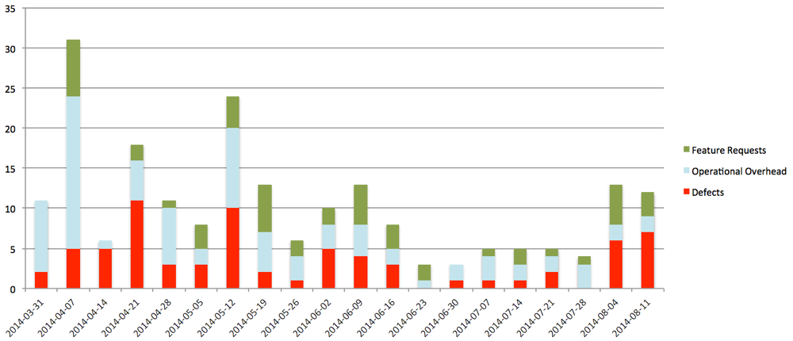
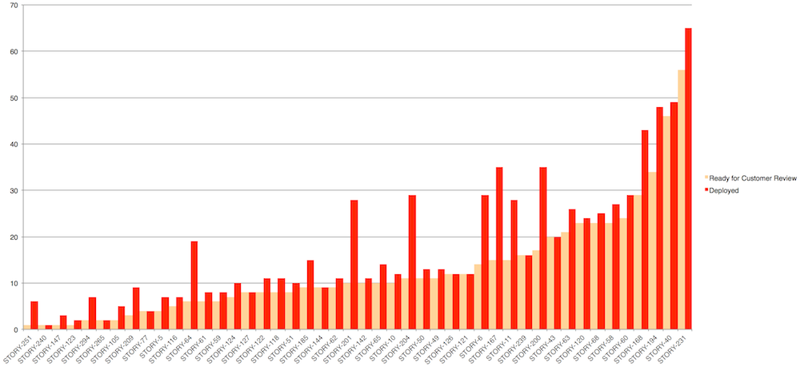
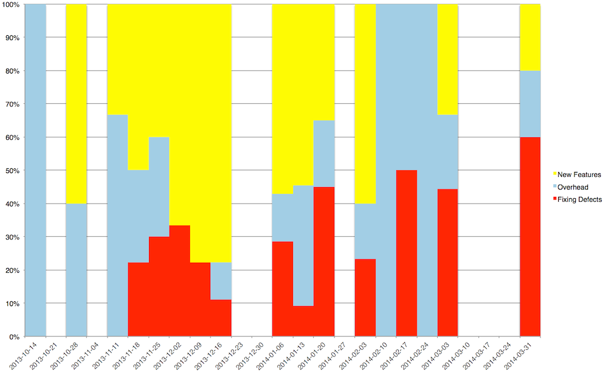
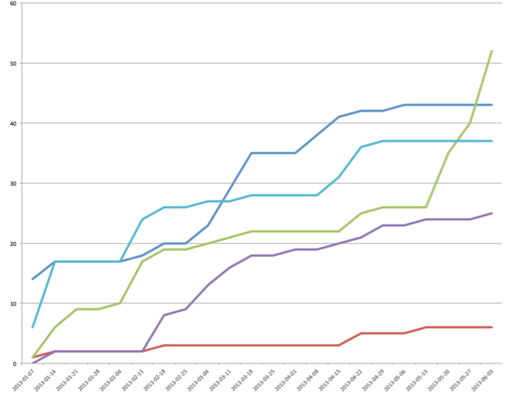
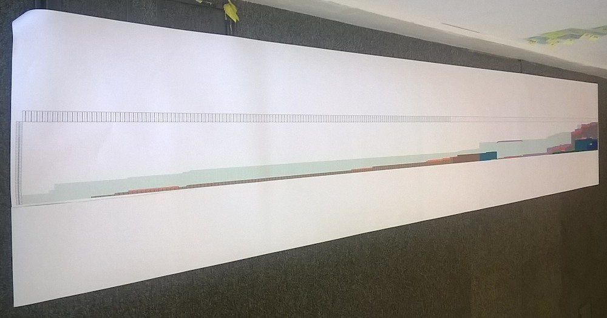

# JIRA _lean forward_ 

## Extract _forward_ looking indicators from JIRA

JLF pulls metrics out of JIRA so we can measure:

* Throughput
* Cycle Time
* Ratio of Overhead / Value / Failure work

It is intended to complement the existing [kanban reporting](https://confluence.atlassian.com/display/AGILE/JIRA+Agile+Documentation) built into Jira Agile.

## Installation

* Clone this repo
* Create a virtual environment e.g.

        virtualenv jlf
        source jlf/bin/activate
	
* Install with setup.py

	    python setup.py install
	
## Configuration

To start getting metrics out of JIRA you'll need a JSON config file describing your JIRA instance, the filters for the issues you want to report on, different types of work, cycles and the metrics you want to extract.

### Jira Instance

JLF needs to know where to look for the issues to report on.  You need to provide a server URL, username and password:

    "server": "https://worldofchris.atlassian.net",
    "username": "readonly",
    "password": "WTFFTW!",
    
### Categories

You can get metrics one or a number of separate sets of issues.  Typically these might be all the issues associated with a particular project or with a specific release (FixVersion) of a project

    "categories": {
		"project-x": "(project = 'Project X')"
        "infrastructure-work": "('Epic Link' = INF-250)",
    },

### Types

The principal motivation for writing JLF was to be able to report on how much work was adding value and how much work was due to failure demand.  To do this JLF allows you to group JIRA issue types accordingly:

    "types": {
        "failure": ["Bug", "Fault"],
        "value": ["New Feature", "Story", "Improvement"],
        "oo": ["Task", "Decision", "User Support", "Spike"]
    },

### Cycles

Another motivation was to be able to compare different cycles within the end to end value chain.  For example, to compare how long it took for work to get from the start of development to being ready for the customer to review with how long it took to actually get into production.

To do this JLF lets you specify a number of cycles.  Each cycle is described in terms of a start state, and end state and an optional state from which transitions can be ignored.  This last option is to allow for workflows where issues cannot be edited after they have been closed but are re-opened for administrative purposes, such as to change the assignee or the resolution type:

    "cycles": {
        "deployment": {
            "start":  "In Progress",
            "end":    "Closed",
            "ignore": "Reopened" 
        },
        "customer-queue": {
            "start": "In Progress",
            "end": "Awaiting Customer Review",
            "ignore": "Reopened"
        }
    },

### Definition of Done

In order to calculate throughput, JLF needs to know what constitutes a successfully completed piece of work.  By default this is:

	 AND issuetype in standardIssueTypes() AND resolution in (Fixed) AND status in (Closed)
	 
This will most likely not fit all workflows so you can configure it to match yours with:

    "counts_towards_throughput": " AND issuetype in standardIssueTypes() AND status in (Closed)",

### Metrics

The output of JLF appears in an Excel (.xlsx) spreadsheet.  Other output formats are planned but for now you just need to specify Excel format with:

    "format": "xlsx",

The name of the spreadsheet is set with:

    "name": "reports",

The location the spreadsheet should be written to is set with:

    "location": "."

The metrics to be included are then specified in:

	"reports": [..],
	    
The following metrics are available and can be configured as described below:

#### Demand

What sort of work are we being asked to do?  How much of it is to add value?  How much of it is dealing with defects or problems in the system?  How much of it is operational overhead?

This metric allows you to produce graphs like this one:

This project is generating around four defects a week!

        {
            "metric": "demand",
            "categories": "foreach",
            "types": [
                "failure", "value", "oo"
            ]
        },

#### Done

What work have we completed and how long did it take to complete?

The *Done* report lists all the work that has been completed along with the cycle times for that work.

This report is used to create simple bar chart control charts:

 

Here you can see the cycle time for getting as far as being ready for customer review and the cycle time for actually getting to deployment.

On this project the team were pretty good at working with the customer to get work reviewed and deployed as soon after development as possible.  There were as you can see some notable exceptions.

See Section 12.3 of Henrik Kniberg's *Lean from the Trenches* for some great examples and insights on using bar graphs as control charts.

        {
            "metric": "done",
            "categories": "foreach",
            "types": "foreach",
            "sort": "week-done"
        },

#### Throughput

How much work do we complete each week?

This report is used to create a bar chart showing how much of throughput is devoted to different types of work:

On this project you can see the amount of throughput dedicated to addressing failure demand start to increase as the weeks go by.  The more time spent fixing defects, the less can be spent adding new features.

        {
            "metric": "throughput",
            "categories": "foreach",
            "types": [
                "failure", "value", "oo"
            ]
        },
  
#### Cumulative Throughput

This is a simpler view than Cumulative Flow and is particularly useful if you want to compare a number of concurrent projects or workstreams:

In this graph we see a number of concurrent projects, several of which are flatlining because the team simply have too many projects in flight at once!

Chapter 12 of Henrik Kniberg's *Lean from the Trenches* is very good on using cumulative throughput, or velocity as he calls it, as a feedback mechanism for managing work.

        {
            "metric": "cumulative-throughput",
            "categories": "foreach",
            "types": "foreach"
        },

#### Cumulative Flow

You can make some pretty big Cumulative Flow Diagrams:

The 'colouring in' of this one was done using a bit of [VBA](https://gist.github.com/worldofchris/c1652352f55619c0420f).

        {
            "metric": "cfd",
            "types": "foreach"
        },

#### Issue History

Issue History is based on Benjamin Mitchell's blog post on [item history tracking](http://blog.benjaminm.net/2012/06/26/how-to-study-the-flow-or-work-with-kanban-cards).

I find it useful for showing specific examples of work that has spent a long time waiting to be worked on, or has come back round through the development cycle several times:

        

        {
            "metric": "history",
            "types": "foreach"
        },

## Use

Once you have a config file you can run jlf with:

		jlf -c CONFIG_FILE -n NUM_WEEKS
		
Where `CONFIG_FILE` is the path to your config file and `NUM_WEEKS` is the number of weeks of work you want to report on.

## Development

### Running the tests

* Run the tests with:

	    nosetests

* To run a single test, specify the path to the module, the Test Case Class Name and the test Case Name.  e.g.

		nosetests jira_stats.test.test_get_issues:TestGetMetrics.testGetArrivalRate

	

